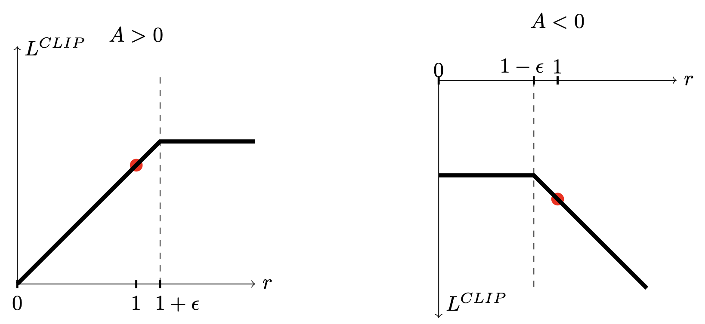
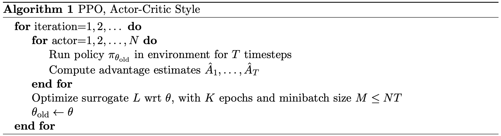
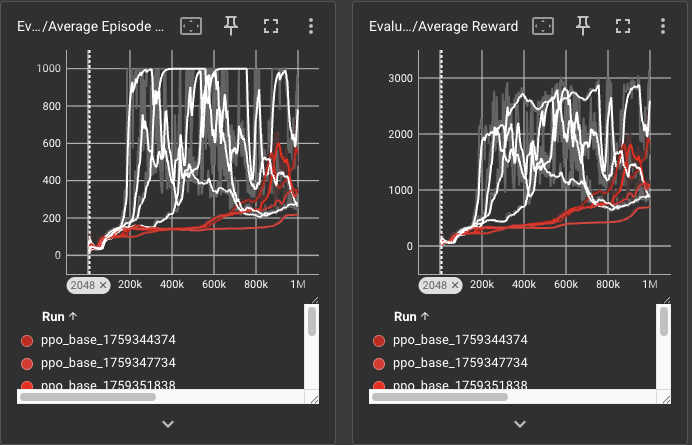
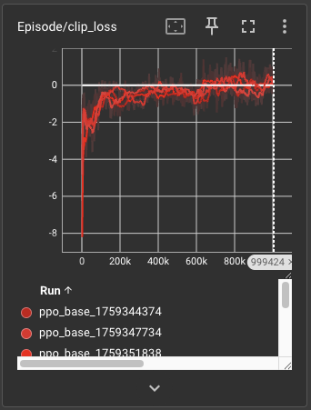
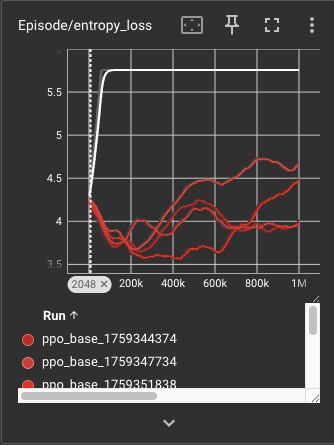
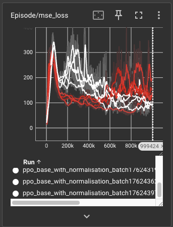

# rl-mujoco


# Policy Gradient algorithms
Policy Gradient algorithms take a different route compared to Value based algorithms. 
In value based algorithms, the policy is estimated based on the state or state-action value estimates. 
In policy gradient methods instead, the policy is estimated directly. 
As such, we have an explicit parametrization of the policy $\pi_{\theta}(a)$ which outputs a probability distribution over the action space.
This has a few advantages, in particular: (i) the policy definition can naturally handle multi-mode or stochastic policies while this is not straightforward for state-action value estimation where epsilon-greedy introduces stochasticity but the policies are generally single-mode on the action with the highest expected reward, (ii) ??.

Policy gradients are framed as a maximisation problem where the objective is a performance function $J$, generally defined as the value of some starting state $s_0$:
```math
J(\theta) = v_{\pi_{\theta}}(s_0)
```

Through the policy gradient theorem and additional manipulations, we find the REINFORCE objective:
```math
\nabla J(\theta) \propto \mathbb{E}_{a_t \sim \pi(* | \theta), s_t \sim \tau}[G_t \frac{\nabla \pi(a_t | s_t, \theta)}{\pi(a_t | s_t, \theta)}]
```
where $G_t$ is the return of the episode starting from timestep t, with the expecation taken over actions sampled from the policy with the corresponding parameters and the states follow the environment's transition probabilities.
Basically, the REINFORCE gradient is an average of the policy gradients with a weighting which is: (i) proportional to the reward obtained along the trajectory and (ii) inversely proportional to the probability of the given action, as frequent actions would occur more in the trajectories hence would be over-represented compared to rare actions in the computation of expected value.

While this expression provides a maximisation target, the optimisation on $\theta$ has to be managed with care: since the trajectories are sampled from a distribution generated by a specific $\theta$, as you move away from that $\theta$ towards one which is optimal on the objective the validity of the objective itself is more and more dubious. 
Basically, we use this expression to compute the gradient in a specific $\theta$, and to do this you estimate the expected value where the actions are taken from the corresponding policy (ie: with $\theta$). 
But as soon as you make an update to $\theta$, if you re-use the same trajectories, then this equation doesnt hold anymore, as they are sampled from a policy which is different compared to the one you want to compute the gradient for.
Overall, one can assume that even after making sufficiently small modifications of $\theta$, the approximation still provides a good signal.
This is true, but it is unclear how small such drifts have to be.
As an example, in REINFORCE it is common to take steps which are too big in the direction of this objective, and suddenly you have a steep performance regression.
To address this, TRPO maximizes the surrogate objective:
```math
\mathbb{E}_{a_t \sim \pi(* | \theta), s_t \sim \tau}[A_t \frac{\pi(a_t | s_t, \theta)}{\pi_{old}(a_t | s_t, \theta)}]
```
subject to the new policy having a KL divergence from the old policy smaller than some parameter.
Note that the above expression is not the estimate of the gradient, rather its what you maximize - this is why there is no gradient on the new policy.
Compared to REINFORCE, the main difference in the expression (apart from the advantage used instead of the return) is that there is the old policy in the denominator rather than the new policy.
This is an importance-sampling ratio, which comes up from the TRPO paper as they perform a first-order approximation on the objective function, which allows using data from the old polich rather than the new policy.
But basically since you have to compute the expectations according to the new policy, rather than the old, there is an importance sampling ratio which comes in (yeah - i didnt fully get it but didnt want to spend much time on it either).


# PPO algorithm
PPO tackles the same problem of trust-region methods by introducing a clipped objective. 
PPO is called Proximal as it solves the issue of having an updated policy which is close to the old one by introducing the clipping, rather than a trust region.
Let:
```math
r = \frac{\pi(a_t | s_t, \theta)}{\pi(a_t | s_t, \theta_{old})}
```
Then, the PPO objective is defined as:
```math
\mathbb{E}[min(rA_t, clip(r, 1-\epsilon, 1+\epsilon) A_t)]
```
Basically, this definition is performs a clip on how much you can optimise in the positive sense, but no clip on the opposite direction. 
With this surrogate, there is no incentive in moving towards region where the ratio between new and old policy is too big, acting as a trust region.
The advantage of these methods is that the distance between the policies is measured in the probability space, rather than in the parameter space: if you can move a lot in the parameter space without impacting the probability, then you can take a lot of steps, otherwise you will take smaller steps.



Notably, compared to REINFORCE, PPO uses advantage estimation (in particular, Generalised Advantage Estimation) rather than return estimation. 
The full PPO objective also contains two additional terms:
- An exploratory term to avoid policy collapse, implemented as a bonus based on policy entropy. 
- A critic term, implemented as the MSE between the observed and predicted advantage. This generally requires a separate network from the policy network.

Then, the (parallel) PPO algorithm proceeds as:



# Generalised Advantage Estimation
Generalised advantage estimation (GAE) has the same conceptual origin as TD($\lambda$) methods: find the right tradeoff between bias and variance.
To estimate the return of a trajectory, one has different options: Monte Carlo estimation is unbiased, but high variance. To reduce variance, one can boostrap, and the simplest form of bootstrapping are one step temporal difference (TD) methods.
Bootstrapping however introduces bias, as the return is estimated as the reward from one step plus the state value of the next state, which in general can bias the estimate as the state value function is itself biased.
GAE is a way to smoothly interpolate between estimates which have different levels of bias and variance, providing a method which is more flexible in mediating them compared to making a discrete choice of using a specific n-step return estimation.
While the policy optimisation objective can vary based on the estimate of the return, the advantage function generally yields the lowest variance estimate, as by definition it only measures how good or bad an action is with respect to the default behaviour of the policy. 
The advantage function is defined as:
```math
A_{\pi}(a, s) = Q_{\pi}(a, s) - V_{\pi}(s)
```
Using the advantage function means that the policy objective points to the direction of increased probability for the given action if and only if the action receives a better than average return compared to the state's value function.
The state value function is thus used as "baseline" against which we measure the actual return, and indeed baselines are used to reduce variance.
Let the k-step advantage be defined as:
```math
A_t^{k} = \sum_{l=0}^{k-1} \gamma^l\delta_{t+l} = -V(s_t) + r_t + \gamma r_{t+1} + ... + \gamma^{k-1}r_{t+k-1} + \gamma^{k}V(s_{t+k})
```
with $\gamma$ a discounting factor (which already introduces bias as it downweighs the future returns) and $\delta_t$ the one-step TD return at step t.
Then, the generalised advantage estimator is:
```math
A_t^{GAE(\gamma, \lambda)} = (1-\lambda)\sum_k \lambda^kA_t^{k} = \sum_k (\gamma \lambda)^k \delta_{t+k}
```
which is the exponentially weighted average of the k-step advantage.
Note that for $\lambda=0$ you recover the one-step TD estimate, while for $\lambda=1$ you recover the discounted monte carlo reward.

# Problem setup

## Policy parametrization
We consider two environments, the Hopper and Half cheetah. 
Both require outputting actions which correspond to continuous values (bounded in [-1,1]) representing the inputs to the motors of the joints.
The output has shape 3 for Hopper, as there are 3 motors to control. 
Since the policy has to define a probability density over the action space [-1,1], the policy outputs a mean and a variance of a gaussian distribution.
The gaussian distribution has domain over [-inf, +inf], so it has to undergo a transformation.
In particular, the policy outputs a log-std and a mean, which both can range on [-inf, +inf].
We can then sample on this space from the $N(\mu, \sigma^2)$ and transform this into the range [-1,1] through a hyperbolic tangent transformation.

This parametrisation requires a bit of care when computing the $r$ ratio.
Since we have to compute the probability of an action over the range [-1,1], we have to follow the transformation to reach the normal distribution.
Moreover, an action is a multi-dimensional vector, so we have to use the vector formula for the change of variables. 
In particular, if $y = g(x)$, where x and y are vectors, we have that:
```math
P_Y(y) = P_X(g^{-1}(y))|det(\frac{dg^{-1}(y)}{dy})|
```
Since x and y are vectors, g is a vector-to-vector mapping and we have to compute its jacobian. 
However, the vector components are independent, so the jacobian is a diagonal matrix and its determinant is the product of the diagonal components, which are the component-wise derivatives of the transformation, which is the same for all and is the hyperbolic tangent.

## PPO computations
We use a parallelized environment where, in general, different episodes proceed independently: at the same time, different episodes will be at different timesteps. 
Moreover, we update the policy every N timesteps, which means the data from the last N timesteps can contain any number K of episodes, where K differs between the different environments.
Most likely, the first and last episode provided as input to the policy updates will be incomplete (first one will have only the final part, while the last one will have the first part).
Therefore, it is important to manage the start/end boundaries, as well as the inter-episode boundaries. 
In our case, the one-step TD errors are computed in parallel as they can be obtained through matrix operations, while the generalised advantage estimator requires looping on the matrix backwards in time to accumulate and discount the one-step TD errors, resetting the accumulation when episode boundaries are hit.

# Results


We evaluate 5 runs on the Hopper and Half-Cheetah environments, with fixed hyperparameters provided in the experiments folder. 
The only difference we test in terms of hyperparameters is the effect of normalising the GAE, and we evaluate the impact of this normalisation on the variance of the gradient norms.
We run for 1 million timesteps in each environment using 16 parallel environments, which on a M1 Pro Mac require roughly 50 minutes.
The policy is updated every 2048 steps, with 5 training epochs using the Adam optimiser.
Below are results for the Hopper runs, where the white lines use advantage normalisation at batch level, while the red dont use advantage normalisation:
:

We can further compare the effect of normalisation on the clip and entropy losses:
:
:
:

We see that:
- for Hopper, the five runs achieve the following maximum scores roughly: [3000, 2500, 2000, 1000, 500], with the high-performing runs having a sudden and huge increase in performance after a long time of stagnation. This suggests that the agent wasnt exploring enough until that point? 
- for Half-Cheetah, the trends are similar but the scores are lower, with the best run reaching roughly 1500 as maximum.
- the sudden jumps in performance are coupled with a jump in the critic MSE loss, likely because the critic has to catch up with the state values induced by the improved policy. For Hopper, the initial spike is "absorbed" (the MSE loss drops shortly after) but this does not hold for subsequent spikes. Thus it seems the critic lags behind the policy for quite a while?
- the mini-batch-level advantage normalisation seems to damage the policy, potentially removing the noise which was causing the exploration or simply leading to small gradients. This can be tested by raising the learning rate and raising the coefficient for the entropy bonus.
- the batch-level advantage normalisation instead yields a faster and seemingly more stable policy (meaning: across multiple runs, results are more stable). This is interesting, theory-wise i am not fully convinced by either of the two normalisations as the rescaling of advantages can change sign of some of them, meaning it could change the direction of the gradients too.
Other interesting implementation details such as value function clipping (similar to the PPO objective for the policy updates), orthogonal initialization of neural networks and other types of normalization are explored in: https://arxiv.org/pdf/2005.12729.

